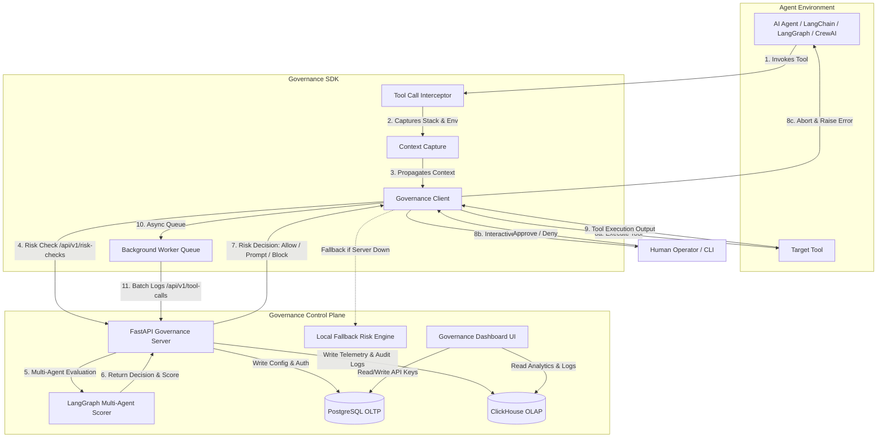

# Governance SDK

> **A plug-and-play AI Agent Governance layer** that intercepts every tool call made by your AI agents — across LangChain, LangGraph, and CrewAI — and evaluates its risk in real time before allowing execution.

[](https://pypi.org/project/governance-sdk/)
[](https://www.python.org/)
[](https://opensource.org/licenses/MIT)
[](#supported-frameworks)

---

## Table of Contents

- [What is Governance SDK?](#what-is-governance-sdk)
- [Key Features](#key-features)
- [Supported Frameworks](#supported-frameworks)
- [Architecture](#architecture)
- [Installation](#installation)
- [Getting an API Key](#getting-an-api-key)
- [Quick Start](#quick-start)
- [Integration Examples](#integration-examples)
  - [LangChain](#langchain)
  - [LangGraph](#langgraph)
  - [CrewAI](#crewai)
- [Configuration Reference](#configuration-reference)
- [Risk Decision Model](#risk-decision-model)
- [Human-in-the-Loop (HITL)](#human-in-the-loop-hitl)
- [Fallback Policies](#fallback-policies)
- [Context Propagation](#context-propagation)
- [Exceptions](#exceptions)
- [Project Structure](#project-structure)

---

## What is Governance SDK?

Modern AI agents can autonomously invoke tools — search the web, run shell commands, delete records, send emails. Without governance, there is no visibility or control over these actions.

**Governance SDK** solves this by sitting transparently between your agent and its tools. It intercepts every single tool call, scores its risk using a multi-agent AI backend, and enforces a configurable policy:

- **Allow** low-risk operations automatically
- **Prompt the human** for medium/high-risk operations (Human-in-the-Loop)
- **Block** operations that require a full security review

Zero code changes needed to your tools. One `init()` call is all it takes.

---

## Key Features

| Feature | Description |
|---|---|
| **Plug-and-Play** | One `init()` call. No changes to your tool definitions. |
| **Universal Interception** | Patches `BaseTool.run`, `BaseTool.arun`, and `CrewStructuredTool.invoke` at the class level — intercepts every tool call, sync or async. |
| **Multi-Framework Support** | Works with LangChain, LangGraph, and CrewAI out of the box. |
| **AI-Powered Risk Scoring** | Sends tool name, description, and arguments to a multi-agent governance server for real-time risk evaluation. |
| **Human-in-the-Loop** | Interactively prompts the developer/operator when a tool is flagged as high risk, showing exactly which file and line number triggered it. |
| **Async Batched Logging** | Logs all tool calls to the governance dashboard in a background thread — zero impact on agent latency. |
| **Resilient Fallback** | When the server is unreachable, falls back to a local rule-based risk engine (`allow`, `block`, or `policy`). |
| **Context Propagation** | Automatically captures or allows manual tagging of `agent_name`, `session_id`, `trace_id` for full audit trail. |

---

## Supported Frameworks

| Framework | Patched Methods | Async Support |
|---|---|---|
| **LangChain** | `BaseTool.run`, `BaseTool.arun` | Yes |
| **LangGraph** | Via `ToolNode` (uses LangChain tools) | Yes |
| **CrewAI** | `BaseTool.run`, `Tool.run`, `CrewStructuredTool.invoke` + async variants | Yes |

---

## Architecture



### Internal Module Map

```
governance_sdk/
├── __init__.py        → Public API: init(), agent_context(), get_active_client()
├── config.py          → SDKConfig: all configuration with env var fallbacks
├── client.py          → GovernanceClient: risk check + async batched logging
├── instrumentor.py    → patch_all(): monkey-patches LangChain & CrewAI at class level
├── context.py         → agent_context() context manager + auto stack-frame capture
├── exceptions.py      → PermissionDeniedError, ReviewRequiredError
└── fallback/          → LocalRiskEngine: offline rule-based risk evaluation
```

---

## Installation

```bash
pip install governance-sdk
```


---

## Getting an API Key

You need an API key to authenticate with the Governance Server and enable the SDK.

**Get your free API key at: [http://16.112.225.189/](http://16.112.225.189/)**

1. Sign up / Log in to the Governance Dashboard
2. Navigate to **API Keys** in the sidebar
3. Click **Generate New Key**
4. Copy the key and store it in your `.env` file:

```env
GOVERNANCE_API_KEY=your_api_key_here
```

> **Important:** The SDK will not activate if `api_key` is not provided. All tool calls will pass through unmonitored.

---

## Quick Start

```python
import governance_sdk

governance_sdk.init(
    api_key="your_api_key_here",
    project_name="my-agent-project"
)

# That's it. All tool calls from LangChain, LangGraph,
# or CrewAI are now intercepted and governed.
```

Or use environment variables and call `init()` with just the key:

```python
import os
import governance_sdk
from dotenv import load_dotenv

load_dotenv()
governance_sdk.init(api_key=os.environ["GOVERNANCE_API_KEY"])
```

---

## Integration Examples

### LangChain

No changes to your tool definitions. Just call `init()` before defining or running your agent.

```python
import os
import governance_sdk
from langchain_core.tools import tool
from langchain.agents import create_agent
from langchain_groq import ChatGroq
from langchain_core.messages import HumanMessage

# 1. Initialize Governance SDK FIRST
governance_sdk.init(
    api_key=os.environ["GOVERNANCE_API_KEY"],
    project_name="langchain-agent"
)

# 2. Define tools as normal — no changes required
@tool
def read_system_status() -> str:
    """Reads the current system status and active services."""
    return '{"status": "healthy", "cpu_usage": "14%"}'

@tool
def execute_system_command(command: str) -> str:
    """Executes a system shell command. WARNING: High risk action!"""
    return f"Command '{command}' executed."

# 3. Build and run your agent — governance is automatic
llm = ChatGroq(model="llama-3.1-8b-instant", temperature=0)
agent = create_agent(
    model=llm,
    tools=[read_system_status, execute_system_command],
    system_prompt="You are a helpful system administrator."
)

result = agent.invoke({"messages": [HumanMessage(content="What is the system status?")]})
```

---

### LangGraph

Works transparently with `ToolNode` since LangGraph uses LangChain tools under the hood.

```python
import os
import governance_sdk
from langchain_core.tools import tool
from langchain_groq import ChatGroq
from langchain_core.messages import BaseMessage, HumanMessage
from langgraph.graph import StateGraph, START, END
from langgraph.prebuilt import ToolNode
from typing import TypedDict, Annotated, Sequence
from langgraph.graph.message import add_messages

# 1. Initialize Governance SDK FIRST
governance_sdk.init(
    api_key=os.environ["GOVERNANCE_API_KEY"],
    project_name="langgraph-agent"
)

# 2. Define tools
@tool
def fetch_user_details(user_id: str) -> str:
    """Fetches user details from the directory database."""
    return f'{{"user_id": "{user_id}", "name": "Jane Doe", "role": "Moderator"}}'

@tool
def delete_user_account(user_id: str) -> str:
    """Deletes a user account permanently. WARNING: Destructive operation."""
    return f"User account '{user_id}' has been permanently deleted."

# 3. Build the LangGraph workflow — governance intercepts ToolNode automatically
class AgentState(TypedDict):
    messages: Annotated[Sequence[BaseMessage], add_messages]

def call_model(state: AgentState):
    llm = ChatGroq(model="llama-3.1-8b-instant", temperature=0)
    llm_with_tools = llm.bind_tools([fetch_user_details, delete_user_account])
    return {"messages": [llm_with_tools.invoke(state["messages"])]}

def should_continue(state: AgentState):
    return "tools" if state["messages"][-1].tool_calls else END

workflow = StateGraph(AgentState)
workflow.add_node("agent", call_model)
workflow.add_node("tools", ToolNode([fetch_user_details, delete_user_account]))
workflow.add_edge(START, "agent")
workflow.add_conditional_edges("agent", should_continue, ["tools", END])
workflow.add_edge("tools", "agent")

graph = workflow.compile()
result = graph.invoke({"messages": [HumanMessage(content="Fetch details for user usr_4001")]})
```

---

### CrewAI

The SDK patches `crewai.tools.BaseTool`, `crewai.tools.base_tool.Tool`, and `CrewStructuredTool` — all CrewAI tool variants are covered.

```python
import os
import governance_sdk
from crewai.tools import tool

# 1. Initialize Governance SDK FIRST
governance_sdk.init(
    api_key=os.environ["GOVERNANCE_API_KEY"],
    project_name="crewai-agent"
)

# 2. Define tools as normal
@tool
def read_configuration() -> str:
    """Reads current workspace configuration."""
    return '{"workspace_root": "/home/user/Projects", "read_only": false}'

@tool
def execute_cleanup_command(command: str) -> str:
    """Executes a database or file cleanup command. WARNING: Destructive command."""
    return f"Cleanup of '{command}' finished."

# 3. Use tools — governance intercepts every .run() / .arun() / .invoke() call
result = read_configuration.run()       # safe, auto-allowed
result = execute_cleanup_command.run(   # flagged, human prompted
    command="rm -rf /var/data"
)
```

---

### Using `agent_context` for Richer Audit Trails

Tag tool calls with agent name, session, and trace IDs for full observability:

```python
import governance_sdk

governance_sdk.init(api_key="...", project_name="my-project")

with governance_sdk.agent_context(
    agent_name="DataCleanupAgent",
    session_id="session-abc-123",
    trace_id="trace-xyz-456"
):
    agent.run("Clean up old records")
    # All tool calls inside this block are tagged with the above metadata
```

---

## Configuration Reference

`governance_sdk.init()` accepts the following parameters (all optional except `api_key`):

| Parameter | Type | Default | Env Variable | Description |
|---|---|---|---|---|
| `api_key` | `str` | **required** | `GOVERNANCE_API_KEY` | Your API key from the dashboard |
| `server_url` | `str` | `http://127.0.0.1:8000/api/v1/tool-calls` | `GOVERNANCE_SERVER_URL` | Tool call log endpoint |
| `risk_check_url` | `str` | Auto-derived from `server_url` | `GOVERNANCE_RISK_CHECK_URL` | Risk scoring endpoint |
| `project_name` | `str` | `"default-project"` | `GOVERNANCE_PROJECT_NAME` | Project label in the dashboard |
| `enabled` | `bool` | `True` | `GOVERNANCE_ENABLED` | Enable/disable the SDK |
| `batch_size` | `int` | `10` | `GOVERNANCE_BATCH_SIZE` | Tool calls batched per HTTP request |
| `flush_interval` | `float` | `1.0` | `GOVERNANCE_FLUSH_INTERVAL` | Seconds between batch sends |
| `max_queue_size` | `int` | `1000` | `GOVERNANCE_MAX_QUEUE_SIZE` | Max queued tool calls before drop |
| `fallback_policy` | `str` | `"policy"` | `GOVERNANCE_FALLBACK_POLICY` | `allow`, `block`, or `policy` |
| `risk_threshold` | `float` | `0.80` | `GOVERNANCE_RISK_THRESHOLD` | Score above which to prompt human |
| `extra_metadata` | `dict` | `{}` | — | Additional metadata sent with every log |

---

## Risk Decision Model

Every tool call goes through the following risk evaluation pipeline:

```
Tool Call Intercepted
       │
       ▼
POST /api/v1/risk-checks
       │
       ▼
┌──────────────────────────────────────────────┐
│             Risk Score Returned               │
│                                              │
│  0.00 – 0.29  →  safe          → ALLOW       │
│  0.30 – 0.59  →  low_risk      → ALLOW       │
│  0.60 – 0.79  →  medium_risk   → PROMPT      │
│  0.80 – 1.00  →  high_risk     → PROMPT      │
│                                              │
│  decision == "needs_full_review" → BLOCK     │
└──────────────────────────────────────────────┘
```

The `risk_threshold` config parameter controls the boundary between auto-allow and prompt. Default is `0.80` — raise it to be more permissive, lower it to be more restrictive.

---

## Human-in-the-Loop (HITL)

When a tool call is flagged as `preview_and_confirmation` or `needs_full_review`, the SDK pauses the agent and prints an interactive prompt:

```
[Governance Alert] Tool 'execute_system_command' execution requested with 'high_risk' risk level (Score: 0.91).
   Reason: Command execution with root-level path detected.
   Risky Parameters: {'command': 'rm -rf /'}
   Triggered from: my_agent.py:63 (in function 'main')
Do you want to authorize this execution? [y/N]:
```

- Enter **`y`** → tool executes and the authorized decision is logged
- Enter **`n`** (or press Enter) → `PermissionDeniedError` is raised, tool is blocked, event is logged

---

## Fallback Policies

When the Governance Server is unreachable, the SDK applies a fallback policy:

| Policy | Behavior |
|---|---|
| `"allow"` | All tool calls are allowed automatically |
| `"block"` | All tool calls are blocked (`needs_full_review`) |
| `"policy"` *(default)* | Local `LocalRiskEngine` evaluates rules-based risk scoring |

Configure via the `fallback_policy` parameter or `GOVERNANCE_FALLBACK_POLICY` env variable.

---

## Context Propagation

The SDK automatically captures context from the call stack without any manual tagging:

- **`agent_name`** — inferred from class names, local variables, or function names
- **`session_id`** — discovered from local variables (`session_id`, `sessionId`, `session`, etc.)
- **`trace_id`** — discovered from local variables (`trace_id`, `traceId`, `correlation_id`)
- **`caller_filename`** — the user script file that triggered the tool call
- **`caller_line_number`** — the exact line number in that file
- **`caller_function`** — the function name that invoked the tool

Override auto-detection with explicit tagging using the `agent_context` context manager (see [above](#using-agent_context-for-richer-audit-trails)).

---

## Exceptions

| Exception | When raised |
|---|---|
| `governance_sdk.PermissionDeniedError` | User denied permission at the HITL prompt (medium/high risk) |
| `governance_sdk.ReviewRequiredError` | Tool was flagged `needs_full_review` and denied at the HITL prompt |
| `governance_sdk.GovernanceError` | Base class for all governance exceptions |

```python
import governance_sdk

try:
    result = my_dangerous_tool.invoke({"command": "rm -rf /"})
except governance_sdk.PermissionDeniedError as e:
    print(f"Blocked by user: {e}")
except governance_sdk.ReviewRequiredError as e:
    print(f"Blocked for full review: {e}")
```

---

## Project Structure

```
GovernanceSDK/
├── governance_sdk/
│   ├── __init__.py          # Public API surface
│   ├── config.py            # SDKConfig with all parameters
│   ├── client.py            # GovernanceClient (HTTP + background queue)
│   ├── instrumentor.py      # Monkey-patching for LangChain & CrewAI
│   ├── context.py           # agent_context() + auto context capture
│   ├── exceptions.py        # PermissionDeniedError, ReviewRequiredError
│   └── fallback/            # LocalRiskEngine (offline fallback)
├── pyproject.toml
└── README.md
```

---

## Dashboard

Monitor all agent tool calls, risk decisions, and blocked actions in real-time at:

**[http://16.112.225.189/](http://16.112.225.189/)**

Features:
- Real-time tool call logs with risk scores
- Per-session agent traces
- Project-level analytics and audit history
- API key management

---

## License

MIT — see [LICENSE](LICENSE) for details.
